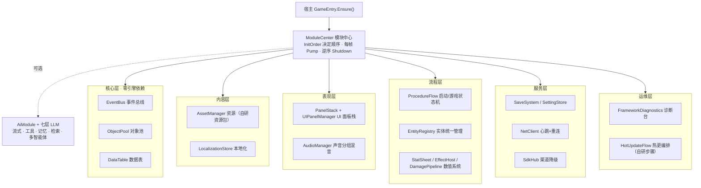

<div align="center">

# Your AI Framework

**Unity3D Modular Game Framework**

[中文](README.md) · 模块化 · 低耦合 · 可测试 · 逐帧驱动

</div>

## 简介 Intro

Your AI Framework 是一套**模块化、低耦合、可测试、逐帧驱动**的 Unity 通用游戏框架：
十八个模块**用哪个就注册哪个**；公开接口里**没有 async/await**，时间由宿主注入，
一切都可以暂停、快进、回放；**407 项离线检查**用 `dotnet run` 就能跑，不用打开编辑器、
不需要 License、无头 CI 也能全覆盖；资源包 / 本地化 / 热更程序集全部**自家实现**，
不依赖任何第三方包；LLM 驱动的 AI（流式对话 / 工具调用 / 多智能体）是其中一个**可选**
模块，不是前提——没有 API Key，框架照样完整工作。

---

## 提供的架构图



## 举个例子（一图胜千言）

场景里挂一个脚本，运行就活——这就是接入全部十八个模块所需的全部代码：

```csharp
using UnityEngine;
using YourFramework.Core;
using YourFramework.UnityRuntime;

public class GameBootstrap : MonoBehaviour
{
    void Awake()
    {
        GameEntry.Ensure()                       // 找到或创建 [GameEntry] 宿主
            .Register(new MyFirstModule());      // 链式注册，要什么加什么
    }
}

public class MyFirstModule : IModule
{
    public string Name => "MyFirst";
    public int InitOrder => 0;                   // 数字小的先初始化，依赖关系就是这个数字
    public void Init(ModuleCenter host) { Debug.Log("模块上线"); }
    public void Pump() { }                       // 每帧
    public void Shutdown() { }                   // 退出时逆序关停
}
```

## 架构使用规范

**所有模块都是 `IModule`，只有五件事：**

- `Name`：模块名，诊断台按这个名字记账；
- `InitOrder`：依赖关系就是数字——小的先初始化，不用查文档、不用维护注册顺序表；
- `Init(host)`：上线，从 `host.Get<T>()` 拿别的模块；
- `Pump()`：逐帧驱动，内核不问引擎时间，宿主决定一帧是什么；
- `Shutdown()`：退出时**逆序**关停。

**三条硬规矩：**

1. **公开接口里没有 async/await**——资源、网络、热更、实体全部由 `Pump` 逐帧驱动，
   可以暂停、快进、回放，无头环境照样测；
2. **出错分两类处理**——自己人写错代码（接错线、空引用）当场 fail-fast 抛出来；
   外部世界的故障（断网、渠道异常）当作"失败也是值"，带上 `FailureReason` 返回，
   界面永远有话能说；
3. **不依赖任何第三方包**——资源包、本地化、热更程序集都是自家实现，换后端只换一个
   实现类（`IBundleBackend` / `IDownloadBackend` / `ILocalizationSource` / `IHotUpdateStep`）。

## 运行环境

- Unity 6000.5+（提交前检查是在 Unity 6.5.8f1 的真实程序集上验证的）
- C# 9.0，核心依赖为零

## 安装

- **方式一（推荐）**：把 `YourAIFramework/` 整个目录拷进工程 `Packages/`；
- **方式二**：Package Manager → `+` → **Add package from disk** → 选 `package.json`；
- **方式三**：Package Manager → `+` → **Add package from git URL** → 填本仓库地址。

## 资源

| 资源 | 说明 | 入口 |
|---|---|---|
| YourAIFramework 本体 | 十八模块 + 可选 AI 七层，包内自带全部源码与文档 | [本仓库](.) |
| Module Demos（从这里开始） | 二十三个模块速览演示，导入就能跑、零资产依赖 | Package Manager → Samples → Import，[导览表](Samples~/ModuleDemos/README.md) |
| Framework-Guide | 完整指南：五分钟上手 → 逐模块手册 → 完整引导示例 → FAQ，26 个小节 | [Documentation~/Framework-Guide.md](Documentation~/Framework-Guide.md) |
| YourAI-Guide | AI 模块深度指南（流式/工具/团队/记忆/检索）+ 附录 A 设计决策记录 | [Documentation~/YourAI-Guide.md](Documentation~/YourAI-Guide.md) |

**提交前检查**

| 检查 | 说明 | 怎么跑 |
|---|---|---|
| `core-test` | 纯 .NET SDK 跑 **407 项检查**，无头、不用编辑器、不要 License | `cd tools/core-test && dotnet run` |
| `transport-compile` | 全部源码链接 Unity 6.5.8f1 真实程序集编译，用来发现引擎接口的变动 | `cd tools/transport-compile && dotnet build` |
| `demo-compile` | 二十三个演示全量编译验证 | `cd tools/demo-compile && dotnet build` |
| `xlua-adapter` | XLua 适配层：对着冻结的公开接口子集编译 + 协议检查（21 项） | `cd tools/xlua-adapter && dotnet run` |

## 设计承诺

1. **基础层独立可用**——没有 API Key、没有网络，框架照样完整工作；
2. **内核只依赖 BCL**——`using UnityEngine` 在内核层是编译错误，不是纪律；
3. **失败也是值，不是流程控制**——降级看得见、带原因、能查询；
4. **逐帧驱动**——内核不问引擎现在几点，宿主来决定一帧是什么。

## 自家实现的能力（不依赖第三方包）

| 能力 | 自家实现 | 引擎侧接口（可替换） |
|---|---|---|
| 资源包 | 清单 + 版本差量 + 下载队列 + 缓存记录 + 依赖整包加载 | `IBundleBackend` / `IDownloadBackend` |
| 本地化 | 表 / 回退链 / 取词源插槽 | `ILocalizationSource` |
| 热更编排 | 阶段式流程（版本 → 下载 → 应用 → 程序集重载） | `IHotUpdateStep` |

这三个能力**不需要安装任何第三方包**：资源包自带打包器（Editor 菜单）与运行时；
本地化与热更建在自家接口上；引擎侧实现（AssetBundle 装载 / UnityWebRequest 下载）
在 `YourFramework.UnityRuntime` 里，换后端只换一个实现类。

## 模块总览

| 分组 | 模块 | 一句话 |
|---|---|---|
| **核心** | `ModuleCenter` / `EventBus` / `ObjectPool` | 模块容器 · 事件总线 · 对象池 |
| **内容** | `DataTable` / `AssetManager` + 自研资源包 / `LocalizationStore` + 自研本地化包 / `AddressCatalog` / `SkillLibrary` + `SkillBook` | 数据表 · 资源（清单/版本/下载/缓存）· 本地化（语言链/多表/CLDR 复数/资源地址）· 地址目录（变体/补丁/校验）· 技能（配置驱动/目标选择/冷却充能/施法流程） |
| **表现** | `PanelStack` + `UIPanelManager` / `AudioManager` | UI 面板栈（PanelRenderer）· 声音分组混音 |
| **流程** | `ProcedureFlow` / `EntityRegistry` / `StatSheet` + `EffectHost` + `DamagePipeline` | 启动/游戏状态机 · 实体统一管理 · 数值（属性/持续效果/伤害） |
| **服务** | `SaveSystem` / `SettingStore` / `NetClient` / `SdkHub` | 存档 · 设置 · 长连接（心跳+重连）· SDK 渠道降级 |
| **运维** | `FrameworkDiagnostics` / `HotUpdateFlow` | 诊断台（错误记录+快照）· 热更编排（自研步骤可插拔） |
| **可选 AI** | `AiModule` + 七层 | LLM 流式对话 · 工具调用 · 多智能体 |

## 状态

Version 0.1.13。本版的变化来自 RPG 演示按"能走框架的必须走框架"全面接入：
演示把面板开合搬进 `PanelStack` 时发现无动画面板走两段式（Open + CompleteOpen）
太啰嗦，给面板栈补了 `OpenNow` / `CloseNow` 同步开关 —— 框架问题由使用方暴露、
在使用方修掉的第一个来回。演示侧同步完成伤害（DamagePipeline）、属性（StatSheet）、
物品表（DataTable）、对象池（GameObjectPool）、UI 面板（PanelStack）五处迁移，
并改版成第三人称大世界（城镇 / 野外 / 副本、野外 Boss）。内核与全部模块的
离线检查全部通过；引擎侧（编辑器导入、真机发声、真实链路联调）正在实机验收。

## License
